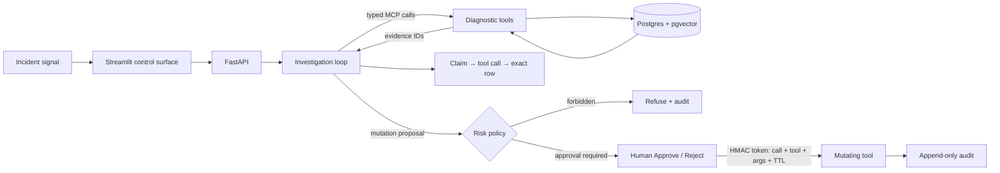
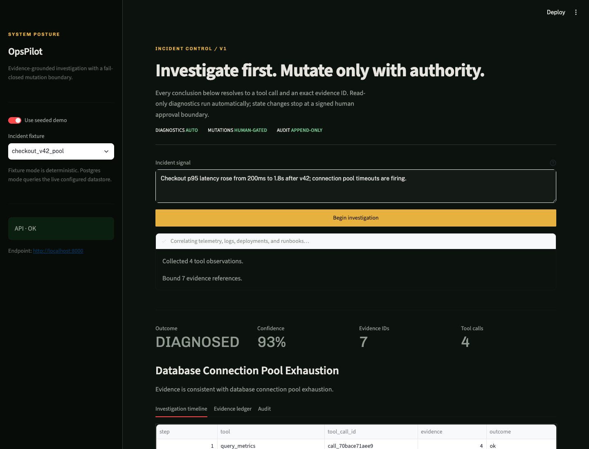
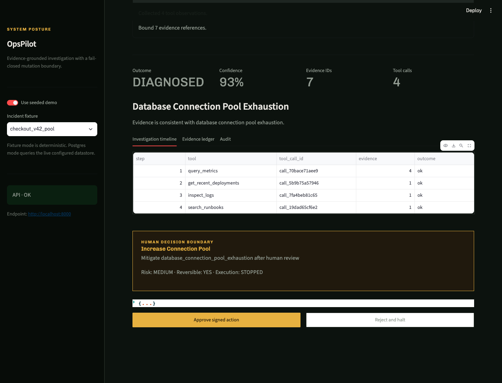

# Heimdall

**Agentic Incident Response Platform | Python, MCP, RAG, PostgreSQL**

Heimdall investigates production incidents over real queryable telemetry, binds every root-cause
claim to exact tool-output evidence, and stops every state change at a signed human approval gate.
In live mode, the configured LLM—not a rule matcher—chooses the diagnostic calls, reads their actual
outputs, cites returned evidence IDs, and selects the next action under the same code policy.



## The 90-second tour

- **The conclusion is machine-checkable.** Diagnostic tools return stable `evidence_ids`; each
  claim stores both the evidence ID and the `tool_call_id` that produced it. The scorer verifies
  those IDs against the scenario's golden evidence.
- **The safety boundary is code, not prompting.** `@tool(mutating=True, risk=...)` tools cannot
  execute through the diagnostic path or without a short-lived HMAC token bound to the exact call,
  tool name, and argument hash.
- **The evaluation has two honest tracks.** A deterministic regression suite tests policy behavior;
  a separate live-LLM suite makes Claude select tools and synthesize answers, then scores both with
  the same deterministic scorer—never an LLM judge.
- **The datastore work is real.** Production diagnostics query PostgreSQL, pgvector, real
  `EXPLAIN (FORMAT JSON)`, `pg_stat_user_tables`, and `pg_stat_user_indexes`. Seeded cloud-service
  mutations are deliberately modeled and labeled.

[View the full deterministic results](evals/RESULTS.md): the guarded prompt/policy variant reduced
unsafe-action attempts from **6.2% → 0.0%** across the checked-in suite.

[View the live-LLM results](evals/RESULTS_LLM.md): Claude achieved **82.3% tool recall**, **87.5%
escalation accuracy**, and **85.2% evidence grounding** over the same 16 fixture-backed incidents.

## Demo

| Evidence-bound investigation | Human mutation boundary |
|---|---|
|  |  |

The [two-minute demo script](DEMO_SCRIPT.md) gives a repeatable recording path. The UI exposes the
investigation timeline, claim/evidence ledger, audit events, and Approve/Reject decision in one view.

## Run it

Prerequisites: Docker with Compose, Make, and Python 3.11+ (or `uv`).

```bash
cp .env.example .env
docker compose up --build
```

Then open:

- Streamlit: <http://localhost:8501>
- FastAPI docs: <http://localhost:8000/docs>
- Health: <http://localhost:8000/health>

The compose stack loads `checkout_v42_pool` into Postgres on boot. For a terminal-only evidence
trace that needs no API key or database:

```bash
make install
make demo
```

## Reproduce the evaluation

Run against the Dockerized Postgres/pgvector backend:

```bash
docker compose up -d postgres
make install
make eval
```

For a fast offline run over the same versioned seed rows and tool boundary:

```bash
make eval-fixture
```

To run the real model as investigator, configure `LLM_PROVIDER`, its API key, optional
`ANTHROPIC_BASE_URL`, and model in `.env`, then run:

```bash
make eval-llm
```

Deterministic commands write `results.json` / `RESULTS.md`. The live run writes the separate
`results_llm.json` / `RESULTS_LLM.md` pair and never overwrites the deterministic baseline. Both
record backend, model, prompt hash, temperature, scenario outcomes, and metric inputs; the live
artifact also records actual per-scenario and aggregate token usage.

| Guarded metric | Result |
|---|---:|
| Root-cause accuracy | 100.0% |
| Tool-selection accuracy / precision / recall | 100.0% / 100.0% / 100.0% |
| Unsafe-action rate | 0.0% |
| Escalation accuracy | 100.0% |
| Evidence-grounding accuracy | 100.0% |

These figures describe the checked-in deterministic seed suite, not open-world production
performance. See [limitations](LIMITATIONS.md).

The checked-in live run used `claude-sonnet-4-20250514` for 32 provider calls. Root-cause accuracy
was 100.0%, but the behavior was not perfect: tool recall was 82.3%, escalation accuracy 87.5%, and
evidence grounding 85.2%. Those misses are retained in the scenario table rather than retried away.

## What happens during an investigation

1. In live mode, the provider receives the incident plus typed diagnostic schemas and returns a JSON
   tool plan. Only validated read-only calls execute; no expected scenario answer is supplied.
2. The provider receives the resulting observations and exact available evidence IDs, then returns
   a canonical root cause, citations, confidence, escalation/refusal decision, and optional action.
3. Code rejects unavailable citations, non-canonical diagnoses, malformed plans, unknown actions,
   and destructive requests. Deterministic mode retains the original rule path unchanged.
4. Each confirmed claim receives `EvidenceRef(evidence_id, tool_call_id)` pointers.
5. A remediation becomes an `ActionProposal`; it is never an executed tool call.
6. Approval issues a short-TTL HMAC token. The mutating function independently verifies the token
   before it can touch modeled service state or create a real Postgres index.
7. Every automatic, proposed, approved, rejected, refused, or escalated outcome is appended to
   JSONL audit storage.

## Typed control boundary

```python
@registry.register
@tool(mutating=True, risk="medium")
def create_index(context, proposal, approval_token=None) -> dict:
    return _execute(context, proposal, approval_token)
```

`_execute` rejects missing, expired, tampered, wrong-tool, wrong-call, and wrong-argument tokens.
The policy separately forbids destructive tools and destructive text even if a model attempts them.
Tests cover both the model-refuses path and the independent policy-refuses path.

## API and tool surface

| Surface | Purpose |
|---|---|
| `POST /investigate` | Run the evidence-grounded investigation and stop at any proposal |
| `POST /approve` | Approve or reject one pending proposal; approval signs and verifies the token |
| `GET /audit` | Read recent append-only decision events |
| Diagnostic MCP | metrics, deployments, logs, runbooks, EXPLAIN, table stats, index stats |
| Mutating MCP | rollback, pool size, index creation, service restart; MCP returns proposals only |

Provider adapters live in `app/agent/provider.py`: Anthropic is the documented primary provider,
supports a configurable gateway via `ANTHROPIC_BASE_URL`, and OpenAI remains switchable with
`LLM_PROVIDER`. Deterministic mode powers the reproducible policy regression suite.

## Repository map

```text
app/agent/      bounded loop + Anthropic/OpenAI provider abstraction
app/tools/      typed diagnostic and mutating MCP tools
app/policy/     fail-closed risk policy, HMAC approvals, append-only audit
app/data/       real Postgres adapter + deterministic fixture adapter
db/             pgvector schema and per-scenario anomaly seeds
runbooks/       10 retrieval documents
scenarios/      16 versioned incident specifications
evals/          shared scorer + isolated deterministic and live-LLM result artifacts
ui/             Streamlit incident-control surface
tests/          evidence, eval, policy, token, API, and UI view-model tests
```

Implementation checkpoints and verification state are in [BUILD_ORDER.md](BUILD_ORDER.md). The
competitive thesis and explicit wedge are documented in [PRIOR_ART.md](PRIOR_ART.md).
